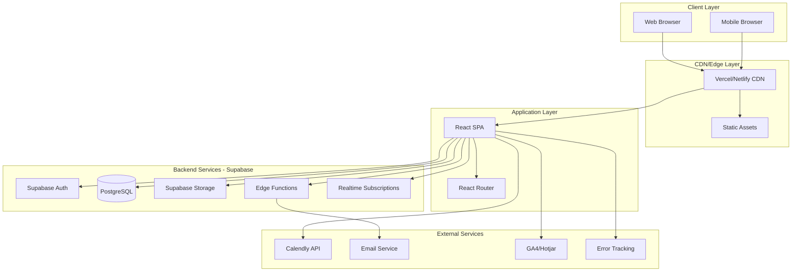
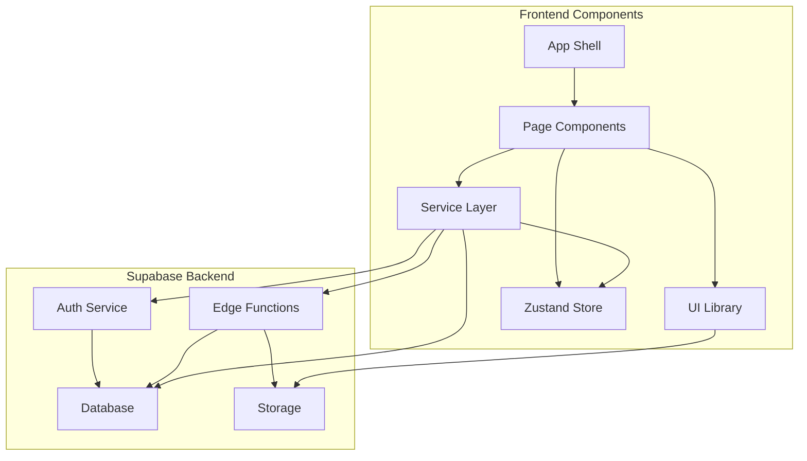
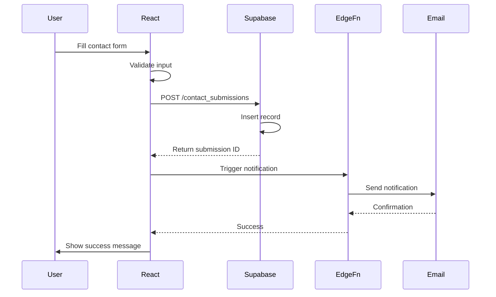
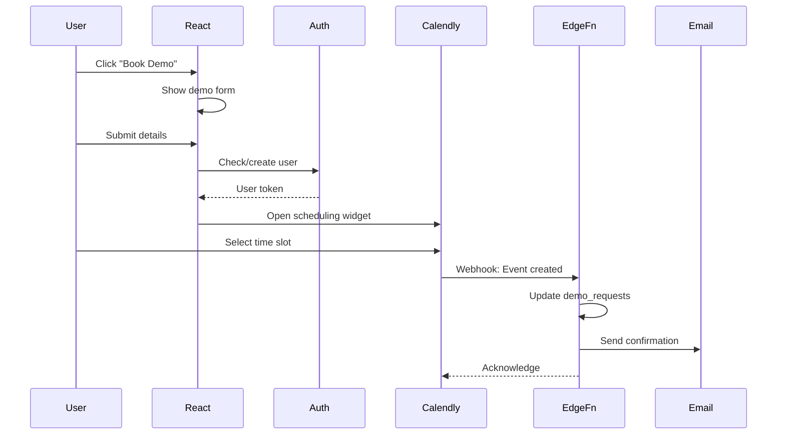
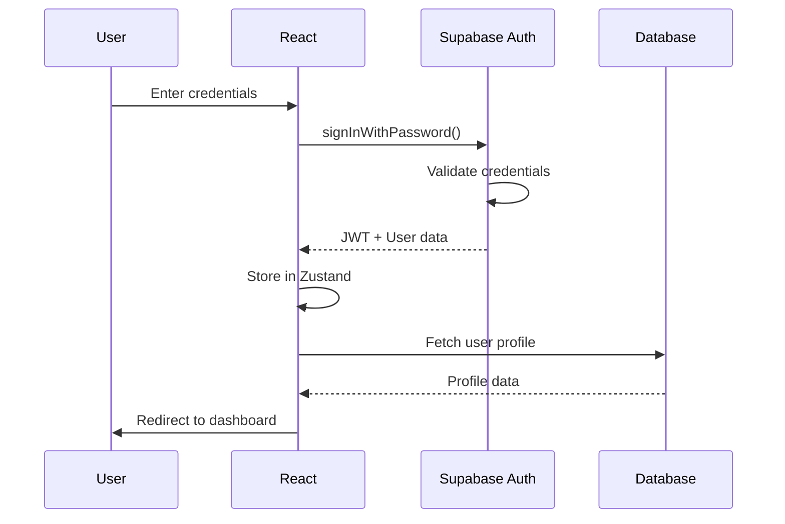
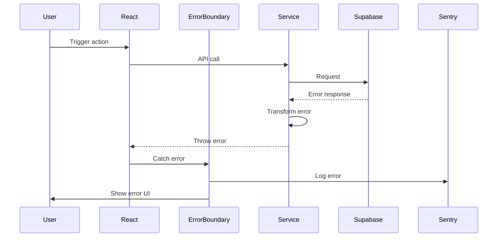

# Refrane Website Fullstack Architecture Document

## Introduction

This document outlines the complete fullstack architecture for Refrane Website, including backend systems, frontend implementation, and their integration. It serves as the single source of truth for AI-driven development, ensuring consistency across the entire technology stack.

This unified approach combines what would traditionally be separate backend and frontend architecture documents, streamlining the development process for modern fullstack applications where these concerns are increasingly intertwined.

### Starter Template or Existing Project

N/A - Greenfield project. Building from scratch using React with Vite and Supabase as the backend platform.

### Change Log

| Date | Version | Description | Author |
|------|---------|-------------|--------|
| 2025-08-15 | 1.0 | Initial architecture document creation | Architect |

## High Level Architecture

### Technical Summary

The Refrane website employs a modern Jamstack architecture with React SPA frontend deployed on Vercel/Netlify and Supabase providing the complete backend infrastructure. The frontend uses Vite for blazing-fast development and optimized production builds, while Supabase handles authentication, database, real-time subscriptions, and edge functions for server-side logic. Key integration points include Supabase client SDK for data fetching, Row Level Security for authorization, and edge functions for email notifications. This architecture achieves the PRD goals of 90+ PageSpeed scores through static hosting with CDN distribution while maintaining dynamic functionality through Supabase's real-time capabilities.

### Platform and Infrastructure Choice

**Platform:** Supabase + Vercel/Netlify
**Key Services:** 
- Supabase: PostgreSQL database, Auth, Storage, Edge Functions, Realtime
- Vercel/Netlify: Static hosting, CDN, Edge network
- Cloudflare: CDN and DDoS protection (optional)

**Deployment Host and Regions:** 
- Frontend: Global CDN via Vercel/Netlify
- Backend: Supabase (AWS us-east-1 primary, with read replicas as needed)

### Repository Structure

**Structure:** Monorepo
**Monorepo Tool:** npm workspaces (built into npm 7+)
**Package Organization:** 
- `packages/web` - React frontend application
- `packages/shared` - Shared TypeScript types and utilities
- `packages/supabase` - Supabase client configuration and types

### High Level Architecture Diagram



### Architectural Patterns

- **Jamstack Architecture:** Static site generation with serverless APIs - _Rationale:_ Optimal performance and scalability for content-heavy marketing website
- **Component-Based UI:** Reusable React components with TypeScript - _Rationale:_ Maintainability and type safety across large codebases
- **Atomic Design Pattern:** Atoms → Molecules → Organisms → Templates → Pages - _Rationale:_ Systematic component organization and reusability
- **Container/Presenter Pattern:** Separate logic from presentation in React components - _Rationale:_ Better testability and separation of concerns
- **Repository Pattern:** Abstract Supabase queries into service layer - _Rationale:_ Enables testing and future database migration flexibility
- **BFF Pattern (Backend for Frontend):** Edge functions tailored for frontend needs - _Rationale:_ Optimize API responses for specific UI requirements
- **Optimistic UI Updates:** Update UI before server confirmation - _Rationale:_ Better perceived performance for user interactions
- **Error Boundary Pattern:** Graceful error handling in React - _Rationale:_ Prevent full app crashes from component errors

## Tech Stack

### Technology Stack Table

| Category | Technology | Version | Purpose | Rationale |
|----------|------------|---------|---------|-----------|
| Frontend Language | TypeScript | 5.3+ | Type-safe development | Catches errors at compile time, better IDE support |
| Frontend Framework | React | 18.2+ | UI component library | Industry standard, large ecosystem, great performance |
| UI Component Library | Custom + Radix UI | Latest | Accessible components | Radix for complex components, custom for brand-specific |
| State Management | Zustand | 4.5+ | Global state management | Simple, lightweight, TypeScript-friendly |
| Backend Language | TypeScript | 5.3+ | Edge functions | Consistency with frontend, type safety |
| Backend Framework | Supabase Edge Functions | Latest | Serverless functions | Built-in to Supabase, automatic scaling |
| API Style | REST + RPC | N/A | API communication | Supabase PostgREST + custom RPC for complex operations |
| Database | PostgreSQL | 15+ | Primary database | Supabase-managed, powerful, reliable |
| Cache | Supabase CDN | Built-in | Query caching | Automatic caching for database queries |
| File Storage | Supabase Storage | Latest | Images and assets | Integrated with auth, CDN-backed |
| Authentication | Supabase Auth | Latest | User authentication | Built-in, supports social logins, magic links |
| Frontend Testing | Vitest + React Testing Library | Latest | Unit/Integration tests | Fast, Jest-compatible, React-specific utilities |
| Backend Testing | Deno Test | Built-in | Edge function tests | Built into Supabase Edge Functions |
| E2E Testing | Playwright | 1.40+ | End-to-end testing | Cross-browser support, reliable, fast |
| Build Tool | Vite | 5.0+ | Frontend bundling | Fastest build tool, great DX, optimized output |
| Bundler | Rollup (via Vite) | Built-in | Production bundling | Tree-shaking, code splitting, optimization |
| IaC Tool | Supabase CLI | Latest | Infrastructure config | Migrations, seeds, function deployment |
| CI/CD | GitHub Actions | N/A | Automation | Free for public repos, great integration |
| Monitoring | Sentry | Latest | Error tracking | Comprehensive error monitoring and performance |
| Logging | Supabase Logs + Console | Built-in | Application logs | Built-in logging for edge functions and database |
| CSS Framework | Tailwind CSS | 3.4+ | Utility-first CSS | Fast development, consistent styling, small bundle |

## Data Models

### User

**Purpose:** Represents authenticated users who can book consultations or request demos

**Key Attributes:**
- id: UUID - Unique identifier (matches Supabase Auth)
- email: string - User email address
- full_name: string - User's full name
- company: string - Company name
- role: string - Job title/role
- phone: string (optional) - Contact number
- created_at: timestamp - Account creation date
- updated_at: timestamp - Last update date

#### TypeScript Interface

```typescript
interface User {
  id: string;
  email: string;
  full_name: string;
  company: string;
  role: string;
  phone?: string;
  created_at: Date;
  updated_at: Date;
}
```

#### Relationships
- Has many ContactSubmissions
- Has many DemoRequests

### ContactSubmission

**Purpose:** Stores all contact form submissions for both services

**Key Attributes:**
- id: UUID - Unique identifier
- user_id: UUID (optional) - Reference to user if authenticated
- service_type: enum - 'business_development' | 'recruite_flow'
- name: string - Contact name
- email: string - Contact email
- company: string - Company name
- message: text - Inquiry message
- status: enum - 'new' | 'contacted' | 'qualified' | 'closed'
- created_at: timestamp - Submission date

#### TypeScript Interface

```typescript
interface ContactSubmission {
  id: string;
  user_id?: string;
  service_type: 'business_development' | 'recruite_flow';
  name: string;
  email: string;
  company: string;
  message: string;
  status: 'new' | 'contacted' | 'qualified' | 'closed';
  created_at: Date;
}
```

#### Relationships
- Belongs to User (optional)

### DemoRequest

**Purpose:** Tracks Recruite Flow OS demo requests and access requests

**Key Attributes:**
- id: UUID - Unique identifier
- user_id: UUID (optional) - Reference to user
- request_type: enum - 'demo' | 'early_access'
- company_size: string - Company size range
- current_ats: string - Current ATS/tools in use
- pain_points: text - Main challenges
- scheduled_date: timestamp (optional) - Demo date if scheduled
- status: enum - 'pending' | 'scheduled' | 'completed' | 'no_show'
- created_at: timestamp - Request date

#### TypeScript Interface

```typescript
interface DemoRequest {
  id: string;
  user_id?: string;
  request_type: 'demo' | 'early_access';
  company_size: string;
  current_ats: string;
  pain_points: string;
  scheduled_date?: Date;
  status: 'pending' | 'scheduled' | 'completed' | 'no_show';
  created_at: Date;
}
```

#### Relationships
- Belongs to User (optional)

### CaseStudy

**Purpose:** Stores case studies for both business development and Recruite Flow

**Key Attributes:**
- id: UUID - Unique identifier
- title: string - Case study title
- client: string - Client company name
- industry: string - Industry vertical
- challenge: text - Problem statement
- solution: text - Solution provided
- results: jsonb - Metrics and outcomes
- service_type: enum - 'business_development' | 'recruite_flow'
- featured: boolean - Homepage display flag
- published: boolean - Public visibility
- created_at: timestamp - Creation date

#### TypeScript Interface

```typescript
interface CaseStudy {
  id: string;
  title: string;
  client: string;
  industry: string;
  challenge: string;
  solution: string;
  results: {
    metrics: Array<{
      label: string;
      value: string;
      improvement?: string;
    }>;
    testimonial?: string;
  };
  service_type: 'business_development' | 'recruite_flow';
  featured: boolean;
  published: boolean;
  created_at: Date;
}
```

#### Relationships
- None (standalone content)

## API Specification

### REST API Specification

Since we're using Supabase, the API is automatically generated from the database schema using PostgREST. Additionally, we'll create Edge Functions for complex operations.

#### Supabase Auto-Generated REST Endpoints

```yaml
# Base URL: https://[PROJECT_ID].supabase.co/rest/v1

# Users endpoint (requires auth)
GET    /users          # List users (admin only)
GET    /users?id=eq.{id}  # Get specific user
PATCH  /users?id=eq.{id}  # Update user profile

# Contact Submissions
POST   /contact_submissions  # Create new submission
GET    /contact_submissions  # List submissions (admin only)
PATCH  /contact_submissions?id=eq.{id}  # Update status

# Demo Requests  
POST   /demo_requests  # Create demo request
GET    /demo_requests  # List requests (admin only)
PATCH  /demo_requests?id=eq.{id}  # Update request

# Case Studies (public read)
GET    /case_studies?published=eq.true  # Get published case studies
GET    /case_studies?featured=eq.true&published=eq.true  # Get featured studies
```

#### Supabase Edge Functions (Custom Endpoints)

```typescript
// Edge Function: /functions/v1/send-contact-notification
interface SendContactNotificationRequest {
  submissionId: string;
  recipientType: 'business' | 'recruitment';
}

// Edge Function: /functions/v1/schedule-demo
interface ScheduleDemoRequest {
  demoRequestId: string;
  calendlyEventUri: string;
  scheduledDate: string;
}

// Edge Function: /functions/v1/analytics-event
interface AnalyticsEventRequest {
  event: string;
  properties: Record<string, any>;
  userId?: string;
}
```

## Components

### Frontend Components

#### React Application Shell

**Responsibility:** Main application container with routing, global state, and error boundaries

**Key Interfaces:**
- App.tsx - Root component with providers
- AppRouter.tsx - Route definitions
- ErrorBoundary.tsx - Global error handling

**Dependencies:** React, React Router, Zustand, Supabase Client

**Technology Stack:** React 18, TypeScript, React Router v6

#### UI Component Library

**Responsibility:** Reusable UI components following Atomic Design pattern

**Key Interfaces:**
- Atoms: Button, Input, Badge, Icon
- Molecules: Card, FormField, NavLink
- Organisms: Header, Footer, ContactForm, ScreenshotGallery

**Dependencies:** Radix UI primitives, Tailwind CSS

**Technology Stack:** React, Radix UI, Tailwind CSS, Framer Motion

#### Page Components

**Responsibility:** Full page layouts combining organisms and handling page-specific logic

**Key Interfaces:**
- HomePage.tsx - Homepage with toggle and dual CTAs
- BusinessDevelopmentPage.tsx - Service details
- RecruiteFlowPage.tsx - Product showcase
- ContactPage.tsx - Smart contact routing

**Dependencies:** UI Components, Service Layer, Zustand Store

**Technology Stack:** React, TypeScript, React Hook Form

#### Service Layer

**Responsibility:** API communication and data transformation

**Key Interfaces:**
- supabaseClient.ts - Configured Supabase client
- contactService.ts - Contact form submission
- caseStudyService.ts - Fetch case studies
- analyticsService.ts - Track events

**Dependencies:** Supabase Client SDK, TypeScript interfaces

**Technology Stack:** Supabase JS Client, TypeScript

### Backend Components

#### Supabase Edge Functions

**Responsibility:** Server-side business logic and integrations

**Key Interfaces:**
- send-contact-notification - Email notifications
- schedule-demo - Calendly integration
- analytics-event - Server-side analytics

**Dependencies:** Supabase SDK, Email provider SDK

**Technology Stack:** Deno, TypeScript, Supabase Edge Runtime

#### Database Layer

**Responsibility:** Data persistence and access control

**Key Interfaces:**
- Tables: users, contact_submissions, demo_requests, case_studies
- RLS Policies: Row Level Security for auth
- Database Functions: Triggers for updated_at

**Dependencies:** PostgreSQL 15

**Technology Stack:** PostgreSQL, PL/pgSQL

#### Storage Layer

**Responsibility:** File and image storage for screenshots and assets

**Key Interfaces:**
- Buckets: product-screenshots, case-study-images
- Policies: Public read for published content

**Dependencies:** Supabase Storage

**Technology Stack:** Supabase Storage (S3-compatible)

### Component Diagrams



## External APIs

### Calendly API

- **Purpose:** Schedule consultation calls and demo sessions
- **Documentation:** https://developer.calendly.com/api-docs
- **Base URL(s):** https://api.calendly.com
- **Authentication:** OAuth 2.0 or Personal Access Token
- **Rate Limits:** 5,000 requests per hour

**Key Endpoints Used:**
- `GET /scheduling_links` - Get available scheduling links
- `POST /scheduled_events` - Create new event
- `GET /scheduled_events/{uuid}` - Get event details

**Integration Notes:** Embedded scheduling widget on frontend, webhook handling in Edge Functions for event updates

### Google Analytics 4 API

- **Purpose:** Track user behavior and conversion events
- **Documentation:** https://developers.google.com/analytics/devguides/collection/ga4
- **Base URL(s):** https://www.google-analytics.com/mp/collect
- **Authentication:** Measurement ID and API Secret
- **Rate Limits:** No strict limit, best practice < 1000 events/second

**Key Endpoints Used:**
- `POST /mp/collect` - Send events to GA4

**Integration Notes:** Client-side tracking with react-ga4, server-side tracking from Edge Functions for sensitive conversions

### SendGrid API

- **Purpose:** Transactional email for notifications and confirmations
- **Documentation:** https://docs.sendgrid.com/api-reference/mail-send
- **Base URL(s):** https://api.sendgrid.com/v3
- **Authentication:** API Key
- **Rate Limits:** 600 requests/second

**Key Endpoints Used:**
- `POST /mail/send` - Send transactional emails

**Integration Notes:** Used only in Edge Functions, templates stored in SendGrid

## Core Workflows





## Database Schema

```sql
-- Enable UUID extension
CREATE EXTENSION IF NOT EXISTS "uuid-ossp";

-- Users table (extends Supabase Auth)
CREATE TABLE users (
    id UUID PRIMARY KEY REFERENCES auth.users(id) ON DELETE CASCADE,
    email TEXT UNIQUE NOT NULL,
    full_name TEXT NOT NULL,
    company TEXT,
    role TEXT,
    phone TEXT,
    created_at TIMESTAMPTZ DEFAULT NOW(),
    updated_at TIMESTAMPTZ DEFAULT NOW()
);

-- Contact submissions
CREATE TABLE contact_submissions (
    id UUID PRIMARY KEY DEFAULT uuid_generate_v4(),
    user_id UUID REFERENCES users(id) ON DELETE SET NULL,
    service_type TEXT CHECK (service_type IN ('business_development', 'recruite_flow')) NOT NULL,
    name TEXT NOT NULL,
    email TEXT NOT NULL,
    company TEXT NOT NULL,
    message TEXT NOT NULL,
    status TEXT CHECK (status IN ('new', 'contacted', 'qualified', 'closed')) DEFAULT 'new',
    created_at TIMESTAMPTZ DEFAULT NOW()
);

-- Demo requests
CREATE TABLE demo_requests (
    id UUID PRIMARY KEY DEFAULT uuid_generate_v4(),
    user_id UUID REFERENCES users(id) ON DELETE SET NULL,
    request_type TEXT CHECK (request_type IN ('demo', 'early_access')) NOT NULL,
    company_size TEXT NOT NULL,
    current_ats TEXT,
    pain_points TEXT,
    scheduled_date TIMESTAMPTZ,
    status TEXT CHECK (status IN ('pending', 'scheduled', 'completed', 'no_show')) DEFAULT 'pending',
    created_at TIMESTAMPTZ DEFAULT NOW()
);

-- Case studies
CREATE TABLE case_studies (
    id UUID PRIMARY KEY DEFAULT uuid_generate_v4(),
    title TEXT NOT NULL,
    client TEXT NOT NULL,
    industry TEXT NOT NULL,
    challenge TEXT NOT NULL,
    solution TEXT NOT NULL,
    results JSONB NOT NULL,
    service_type TEXT CHECK (service_type IN ('business_development', 'recruite_flow')) NOT NULL,
    featured BOOLEAN DEFAULT FALSE,
    published BOOLEAN DEFAULT FALSE,
    created_at TIMESTAMPTZ DEFAULT NOW()
);

-- Indexes for performance
CREATE INDEX idx_contact_submissions_service ON contact_submissions(service_type);
CREATE INDEX idx_contact_submissions_status ON contact_submissions(status);
CREATE INDEX idx_demo_requests_status ON demo_requests(status);
CREATE INDEX idx_case_studies_published ON case_studies(published, featured);

-- Updated_at trigger function
CREATE OR REPLACE FUNCTION update_updated_at()
RETURNS TRIGGER AS $$
BEGIN
    NEW.updated_at = NOW();
    RETURN NEW;
END;
$$ LANGUAGE plpgsql;

-- Apply trigger to users table
CREATE TRIGGER update_users_updated_at
    BEFORE UPDATE ON users
    FOR EACH ROW
    EXECUTE FUNCTION update_updated_at();

-- Row Level Security (RLS)
ALTER TABLE users ENABLE ROW LEVEL SECURITY;
ALTER TABLE contact_submissions ENABLE ROW LEVEL SECURITY;
ALTER TABLE demo_requests ENABLE ROW LEVEL SECURITY;
ALTER TABLE case_studies ENABLE ROW LEVEL SECURITY;

-- RLS Policies
-- Users can read and update their own profile
CREATE POLICY "Users can view own profile" ON users
    FOR SELECT USING (auth.uid() = id);

CREATE POLICY "Users can update own profile" ON users
    FOR UPDATE USING (auth.uid() = id);

-- Anyone can create contact submissions
CREATE POLICY "Anyone can create contact submission" ON contact_submissions
    FOR INSERT WITH CHECK (true);

-- Only admins can view contact submissions
CREATE POLICY "Admins can view contact submissions" ON contact_submissions
    FOR SELECT USING (auth.jwt() ->> 'role' = 'admin');

-- Anyone can create demo requests
CREATE POLICY "Anyone can create demo request" ON demo_requests
    FOR INSERT WITH CHECK (true);

-- Published case studies are public
CREATE POLICY "Published case studies are public" ON case_studies
    FOR SELECT USING (published = true);
```

## Frontend Architecture

### Component Architecture

#### Component Organization

```text
packages/web/src/
├── components/
│   ├── atoms/
│   │   ├── Button/
│   │   │   ├── Button.tsx
│   │   │   ├── Button.test.tsx
│   │   │   └── index.ts
│   │   ├── Input/
│   │   ├── Badge/
│   │   └── Icon/
│   ├── molecules/
│   │   ├── Card/
│   │   ├── FormField/
│   │   ├── NavLink/
│   │   └── ToggleSwitch/
│   ├── organisms/
│   │   ├── Header/
│   │   ├── Footer/
│   │   ├── ContactForm/
│   │   ├── ScreenshotGallery/
│   │   └── ProblemSolutionToggle/
│   └── templates/
│       ├── PageLayout/
│       └── SectionLayout/
├── pages/
│   ├── HomePage/
│   ├── BusinessDevelopmentPage/
│   ├── RecruiteFlowPage/
│   ├── AboutPage/
│   └── ContactPage/
├── hooks/
│   ├── useAuth.ts
│   ├── useSupabase.ts
│   └── useAnalytics.ts
├── services/
│   ├── supabase.ts
│   ├── contact.service.ts
│   ├── caseStudy.service.ts
│   └── analytics.service.ts
├── stores/
│   ├── authStore.ts
│   └── uiStore.ts
├── utils/
│   ├── constants.ts
│   └── helpers.ts
└── types/
    └── index.ts
```

#### Component Template

```typescript
// Example: Button.tsx
import { forwardRef, ButtonHTMLAttributes } from 'react';
import { cva, type VariantProps } from 'class-variance-authority';
import { cn } from '@/utils/helpers';

const buttonVariants = cva(
  'inline-flex items-center justify-center rounded-md text-sm font-medium transition-colors focus-visible:outline-none focus-visible:ring-2 focus-visible:ring-offset-2 disabled:pointer-events-none disabled:opacity-50',
  {
    variants: {
      variant: {
        primary: 'bg-primary text-white hover:bg-primary-dark',
        secondary: 'border border-primary text-primary hover:bg-primary/10',
        ghost: 'hover:bg-gray-100',
      },
      size: {
        sm: 'h-9 px-3',
        md: 'h-10 px-4 py-2',
        lg: 'h-11 px-8',
      },
    },
    defaultVariants: {
      variant: 'primary',
      size: 'md',
    },
  }
);

export interface ButtonProps
  extends ButtonHTMLAttributes<HTMLButtonElement>,
    VariantProps<typeof buttonVariants> {
  loading?: boolean;
}

const Button = forwardRef<HTMLButtonElement, ButtonProps>(
  ({ className, variant, size, loading, children, ...props }, ref) => {
    return (
      <button
        className={cn(buttonVariants({ variant, size, className }))}
        ref={ref}
        disabled={loading || props.disabled}
        {...props}
      >
        {loading && <Spinner className="mr-2" />}
        {children}
      </button>
    );
  }
);

Button.displayName = 'Button';

export { Button, buttonVariants };
```

### State Management Architecture

#### State Structure

```typescript
// stores/authStore.ts
import { create } from 'zustand';
import { devtools, persist } from 'zustand/middleware';
import type { User } from '@/types';

interface AuthState {
  user: User | null;
  isLoading: boolean;
  error: string | null;
  
  // Actions
  setUser: (user: User | null) => void;
  login: (email: string, password: string) => Promise<void>;
  logout: () => Promise<void>;
  clearError: () => void;
}

export const useAuthStore = create<AuthState>()(
  devtools(
    persist(
      (set, get) => ({
        user: null,
        isLoading: false,
        error: null,
        
        setUser: (user) => set({ user }),
        
        login: async (email, password) => {
          set({ isLoading: true, error: null });
          try {
            const { data, error } = await supabase.auth.signInWithPassword({
              email,
              password,
            });
            if (error) throw error;
            set({ user: data.user, isLoading: false });
          } catch (error) {
            set({ error: error.message, isLoading: false });
          }
        },
        
        logout: async () => {
          await supabase.auth.signOut();
          set({ user: null });
        },
        
        clearError: () => set({ error: null }),
      }),
      {
        name: 'auth-storage',
        partialize: (state) => ({ user: state.user }),
      }
    )
  )
);
```

#### State Management Patterns
- Use Zustand for global state (auth, UI preferences)
- Use React Query/TanStack Query for server state
- Use local component state for UI-only state
- Implement optimistic updates for better UX
- Persist critical state to localStorage

### Routing Architecture

#### Route Organization

```text
src/routes/
├── index.tsx (root routes)
├── home.tsx
├── business-development/
│   ├── index.tsx
│   ├── services.tsx
│   └── case-studies.tsx
├── recruite-flow/
│   ├── index.tsx
│   ├── features.tsx
│   └── pricing.tsx
├── about.tsx
├── contact.tsx
└── _protected/
    └── dashboard.tsx
```

#### Protected Route Pattern

```typescript
// components/ProtectedRoute.tsx
import { Navigate, Outlet } from 'react-router-dom';
import { useAuthStore } from '@/stores/authStore';

export const ProtectedRoute = () => {
  const user = useAuthStore((state) => state.user);
  const isLoading = useAuthStore((state) => state.isLoading);
  
  if (isLoading) {
    return <LoadingSpinner />;
  }
  
  if (!user) {
    return <Navigate to="/login" replace />;
  }
  
  return <Outlet />;
};

// Usage in router
<Route element={<ProtectedRoute />}>
  <Route path="/dashboard" element={<Dashboard />} />
</Route>
```

### Frontend Services Layer

#### API Client Setup

```typescript
// services/supabase.ts
import { createClient } from '@supabase/supabase-js';
import type { Database } from '@/types/database';

const supabaseUrl = import.meta.env.VITE_SUPABASE_URL;
const supabaseAnonKey = import.meta.env.VITE_SUPABASE_ANON_KEY;

export const supabase = createClient<Database>(supabaseUrl, supabaseAnonKey, {
  auth: {
    persistSession: true,
    autoRefreshToken: true,
  },
});

// Type-safe client
export type SupabaseClient = typeof supabase;
```

#### Service Example

```typescript
// services/contact.service.ts
import { supabase } from './supabase';
import type { ContactSubmission } from '@/types';

export class ContactService {
  static async submitContact(data: Omit<ContactSubmission, 'id' | 'created_at'>) {
    const { data: submission, error } = await supabase
      .from('contact_submissions')
      .insert(data)
      .select()
      .single();
    
    if (error) throw error;
    
    // Trigger email notification
    await supabase.functions.invoke('send-contact-notification', {
      body: { submissionId: submission.id },
    });
    
    return submission;
  }
  
  static async getSubmissions(serviceType?: string) {
    let query = supabase
      .from('contact_submissions')
      .select('*')
      .order('created_at', { ascending: false });
    
    if (serviceType) {
      query = query.eq('service_type', serviceType);
    }
    
    const { data, error } = await query;
    if (error) throw error;
    return data;
  }
}
```

## Backend Architecture

### Service Architecture

#### Function Organization

```text
supabase/functions/
├── send-contact-notification/
│   └── index.ts
├── schedule-demo/
│   └── index.ts
├── analytics-event/
│   └── index.ts
└── _shared/
    ├── cors.ts
    ├── email.ts
    └── types.ts
```

#### Function Template

```typescript
// supabase/functions/send-contact-notification/index.ts
import { serve } from 'https://deno.land/std@0.168.0/http/server.ts';
import { createClient } from 'https://esm.sh/@supabase/supabase-js@2';
import { corsHeaders } from '../_shared/cors.ts';
import { sendEmail } from '../_shared/email.ts';

serve(async (req) => {
  // Handle CORS
  if (req.method === 'OPTIONS') {
    return new Response('ok', { headers: corsHeaders });
  }
  
  try {
    const { submissionId } = await req.json();
    
    // Initialize Supabase client
    const supabase = createClient(
      Deno.env.get('SUPABASE_URL')!,
      Deno.env.get('SUPABASE_SERVICE_ROLE_KEY')!
    );
    
    // Fetch submission details
    const { data: submission, error } = await supabase
      .from('contact_submissions')
      .select('*')
      .eq('id', submissionId)
      .single();
    
    if (error) throw error;
    
    // Send email notification
    const emailResult = await sendEmail({
      to: submission.service_type === 'business_development'
        ? Deno.env.get('BD_TEAM_EMAIL')!
        : Deno.env.get('RF_TEAM_EMAIL')!,
      subject: `New ${submission.service_type} inquiry`,
      html: `
        <h2>New Contact Submission</h2>
        <p><strong>Name:</strong> ${submission.name}</p>
        <p><strong>Company:</strong> ${submission.company}</p>
        <p><strong>Email:</strong> ${submission.email}</p>
        <p><strong>Message:</strong> ${submission.message}</p>
      `,
    });
    
    return new Response(
      JSON.stringify({ success: true, emailResult }),
      { headers: { ...corsHeaders, 'Content-Type': 'application/json' } }
    );
  } catch (error) {
    return new Response(
      JSON.stringify({ error: error.message }),
      { headers: { ...corsHeaders, 'Content-Type': 'application/json' }, status: 400 }
    );
  }
});
```

### Database Architecture

#### Schema Design

See Database Schema section above for complete SQL schema.

#### Data Access Layer

```typescript
// Example: Repository pattern for Supabase queries
// packages/shared/src/repositories/caseStudy.repository.ts

export class CaseStudyRepository {
  constructor(private supabase: SupabaseClient) {}
  
  async getFeatured(serviceType?: string) {
    let query = this.supabase
      .from('case_studies')
      .select('*')
      .eq('published', true)
      .eq('featured', true);
    
    if (serviceType) {
      query = query.eq('service_type', serviceType);
    }
    
    const { data, error } = await query.limit(3);
    if (error) throw error;
    return data;
  }
  
  async getByIndustry(industry: string) {
    const { data, error } = await this.supabase
      .from('case_studies')
      .select('*')
      .eq('published', true)
      .eq('industry', industry)
      .order('created_at', { ascending: false });
    
    if (error) throw error;
    return data;
  }
}
```

### Authentication and Authorization

#### Auth Flow



#### Middleware/Guards

```typescript
// supabase/functions/_shared/auth.ts
import { createClient } from 'https://esm.sh/@supabase/supabase-js@2';

export async function requireAuth(req: Request) {
  const authHeader = req.headers.get('Authorization');
  if (!authHeader) {
    throw new Error('No authorization header');
  }
  
  const token = authHeader.replace('Bearer ', '');
  const supabase = createClient(
    Deno.env.get('SUPABASE_URL')!,
    Deno.env.get('SUPABASE_ANON_KEY')!
  );
  
  const { data: { user }, error } = await supabase.auth.getUser(token);
  
  if (error || !user) {
    throw new Error('Invalid token');
  }
  
  return user;
}

// Usage in Edge Function
serve(async (req) => {
  try {
    const user = await requireAuth(req);
    // Proceed with authenticated request
  } catch (error) {
    return new Response('Unauthorized', { status: 401 });
  }
});
```

## Unified Project Structure

```plaintext
refrane-website/
├── .github/                    # CI/CD workflows
│   └── workflows/
│       ├── ci.yaml
│       └── deploy.yaml
├── packages/                   # Monorepo packages
│   ├── web/                    # React frontend
│   │   ├── src/
│   │   │   ├── components/     # UI components (atoms/molecules/organisms)
│   │   │   ├── pages/          # Page components
│   │   │   ├── hooks/          # Custom React hooks
│   │   │   ├── services/       # API client services
│   │   │   ├── stores/         # Zustand stores
│   │   │   ├── styles/         # Global styles/Tailwind
│   │   │   ├── utils/          # Utilities
│   │   │   ├── types/          # TypeScript types
│   │   │   ├── App.tsx         # Root component
│   │   │   └── main.tsx        # Entry point
│   │   ├── public/             # Static assets
│   │   ├── tests/              # Frontend tests
│   │   ├── index.html
│   │   ├── vite.config.ts
│   │   ├── tailwind.config.js
│   │   ├── tsconfig.json
│   │   └── package.json
│   └── shared/                 # Shared code
│       ├── src/
│       │   ├── types/          # Shared TypeScript interfaces
│       │   ├── constants/      # Shared constants
│       │   └── utils/          # Shared utilities
│       ├── tsconfig.json
│       └── package.json
├── supabase/                   # Supabase backend
│   ├── functions/              # Edge Functions
│   │   ├── send-contact-notification/
│   │   │   └── index.ts
│   │   ├── schedule-demo/
│   │   │   └── index.ts
│   │   ├── analytics-event/
│   │   │   └── index.ts
│   │   └── _shared/            # Shared function code
│   │       ├── cors.ts
│   │       ├── email.ts
│   │       └── types.ts
│   ├── migrations/             # Database migrations
│   │   └── 20250815000000_initial_schema.sql
│   ├── seed.sql                # Seed data
│   └── config.toml             # Supabase config
├── scripts/                    # Build/deploy scripts
│   ├── generate-types.sh       # Generate TypeScript from DB
│   └── deploy.sh               # Deployment script
├── docs/                       # Documentation
│   ├── prd.md
│   ├── front-end-spec.md
│   └── architecture.md
├── .env.example                # Environment template
├── package.json                # Root package.json
├── tsconfig.base.json          # Base TypeScript config
└── README.md
```

## Development Workflow

### Local Development Setup

#### Prerequisites

```bash
# Required software
node --version  # v18.0.0 or higher
npm --version   # v9.0.0 or higher
git --version   # v2.0.0 or higher

# Install Supabase CLI
npm install -g supabase
```

#### Initial Setup

```bash
# Clone repository
git clone https://github.com/refrane/website.git
cd refrane-website

# Install dependencies
npm install

# Setup Supabase
supabase init
supabase start  # Starts local Supabase

# Copy environment variables
cp .env.example .env.local
# Edit .env.local with your values

# Run database migrations
supabase db push

# Generate TypeScript types from database
npm run generate:types
```

#### Development Commands

```bash
# Start all services
npm run dev

# Start frontend only
npm run dev:web

# Start Supabase locally
supabase start

# Run tests
npm run test
npm run test:e2e
```

### Environment Configuration

#### Required Environment Variables

```bash
# Frontend (.env.local)
VITE_SUPABASE_URL=http://localhost:54321
VITE_SUPABASE_ANON_KEY=your-anon-key
VITE_GA_MEASUREMENT_ID=G-XXXXXXXXXX
VITE_CALENDLY_URL=https://calendly.com/your-org

# Backend (Supabase Edge Functions)
SUPABASE_URL=http://localhost:54321
SUPABASE_SERVICE_ROLE_KEY=your-service-key
SENDGRID_API_KEY=your-sendgrid-key
BD_TEAM_EMAIL=business@refrane.com
RF_TEAM_EMAIL=recruiteflow@refrane.com

# Shared
NODE_ENV=development
PUBLIC_URL=http://localhost:5173
```

## Deployment Architecture

### Deployment Strategy

**Frontend Deployment:**
- **Platform:** Vercel
- **Build Command:** `npm run build:web`
- **Output Directory:** `packages/web/dist`
- **CDN/Edge:** Vercel Edge Network

**Backend Deployment:**
- **Platform:** Supabase Cloud
- **Build Command:** N/A (managed service)
- **Deployment Method:** Supabase CLI

### CI/CD Pipeline

```yaml
# .github/workflows/deploy.yaml
name: Deploy

on:
  push:
    branches: [main]

jobs:
  test:
    runs-on: ubuntu-latest
    steps:
      - uses: actions/checkout@v3
      - uses: actions/setup-node@v3
        with:
          node-version: '18'
      - run: npm ci
      - run: npm run test
      - run: npm run lint
      - run: npm run type-check

  deploy-frontend:
    needs: test
    runs-on: ubuntu-latest
    steps:
      - uses: actions/checkout@v3
      - uses: actions/setup-node@v3
      - run: npm ci
      - run: npm run build:web
      - uses: amondnet/vercel-action@v20
        with:
          vercel-token: ${{ secrets.VERCEL_TOKEN }}
          vercel-org-id: ${{ secrets.VERCEL_ORG_ID }}
          vercel-project-id: ${{ secrets.VERCEL_PROJECT_ID }}

  deploy-supabase:
    needs: test
    runs-on: ubuntu-latest
    steps:
      - uses: actions/checkout@v3
      - uses: supabase/setup-cli@v1
      - run: supabase functions deploy --project-ref ${{ secrets.SUPABASE_PROJECT_REF }}
        env:
          SUPABASE_ACCESS_TOKEN: ${{ secrets.SUPABASE_ACCESS_TOKEN }}
```

### Environments

| Environment | Frontend URL | Backend URL | Purpose |
|------------|-------------|-------------|---------|
| Development | http://localhost:5173 | http://localhost:54321 | Local development |
| Staging | https://staging.refrane.com | https://staging-project.supabase.co | Pre-production testing |
| Production | https://refrane.com | https://prod-project.supabase.co | Live environment |

## Security and Performance

### Security Requirements

**Frontend Security:**
- CSP Headers: `default-src 'self'; script-src 'self' 'unsafe-inline' *.google-analytics.com; style-src 'self' 'unsafe-inline';`
- XSS Prevention: React's built-in escaping, DOMPurify for user content
- Secure Storage: Sensitive data in httpOnly cookies, non-sensitive in localStorage

**Backend Security:**
- Input Validation: Zod schemas for all API inputs
- Rate Limiting: 100 requests per minute per IP
- CORS Policy: Allow only frontend domain and localhost in dev

**Authentication Security:**
- Token Storage: Secure httpOnly cookies for refresh tokens
- Session Management: 7-day refresh token, 1-hour access token
- Password Policy: Minimum 8 characters, complexity requirements

### Performance Optimization

**Frontend Performance:**
- Bundle Size Target: < 200KB initial JS
- Loading Strategy: Lazy load routes and heavy components
- Caching Strategy: Service worker for static assets, React Query for API responses

**Backend Performance:**
- Response Time Target: < 200ms p95
- Database Optimization: Proper indexes, connection pooling
- Caching Strategy: Supabase built-in query caching, CDN for Storage

## Testing Strategy

### Testing Pyramid

```text
          E2E Tests
         /        \
    Integration Tests
       /            \
  Frontend Unit  Backend Unit
```

### Test Organization

#### Frontend Tests

```text
packages/web/tests/
├── unit/
│   ├── components/
│   ├── hooks/
│   └── utils/
├── integration/
│   ├── services/
│   └── stores/
└── setup.ts
```

#### Backend Tests

```text
supabase/tests/
├── functions/
│   ├── send-contact-notification.test.ts
│   └── schedule-demo.test.ts
└── database/
    └── policies.test.sql
```

#### E2E Tests

```text
e2e/
├── specs/
│   ├── contact-flow.spec.ts
│   ├── demo-booking.spec.ts
│   └── navigation.spec.ts
└── playwright.config.ts
```

### Test Examples

#### Frontend Component Test

```typescript
// Button.test.tsx
import { render, screen } from '@testing-library/react';
import userEvent from '@testing-library/user-event';
import { Button } from './Button';

describe('Button', () => {
  it('renders with text', () => {
    render(<Button>Click me</Button>);
    expect(screen.getByText('Click me')).toBeInTheDocument();
  });
  
  it('handles click events', async () => {
    const handleClick = vi.fn();
    render(<Button onClick={handleClick}>Click me</Button>);
    
    await userEvent.click(screen.getByText('Click me'));
    expect(handleClick).toHaveBeenCalledTimes(1);
  });
});
```

#### Backend API Test

```typescript
// send-contact-notification.test.ts
import { assertEquals } from 'https://deno.land/std@0.168.0/testing/asserts.ts';

Deno.test('send-contact-notification function', async () => {
  const response = await fetch('http://localhost:54321/functions/v1/send-contact-notification', {
    method: 'POST',
    headers: {
      'Content-Type': 'application/json',
      'Authorization': `Bearer ${Deno.env.get('SUPABASE_ANON_KEY')}`,
    },
    body: JSON.stringify({
      submissionId: 'test-uuid',
    }),
  });
  
  assertEquals(response.status, 200);
  const data = await response.json();
  assertEquals(data.success, true);
});
```

#### E2E Test

```typescript
// contact-flow.spec.ts
import { test, expect } from '@playwright/test';

test('submit contact form', async ({ page }) => {
  await page.goto('/contact');
  
  await page.fill('[name="name"]', 'John Doe');
  await page.fill('[name="email"]', 'john@example.com');
  await page.fill('[name="company"]', 'Acme Corp');
  await page.fill('[name="message"]', 'I need help scaling my business');
  
  await page.click('button[type="submit"]');
  
  await expect(page.locator('.success-message')).toBeVisible();
  await expect(page.locator('.success-message')).toContainText('Thank you');
});
```

## Coding Standards

### Critical Fullstack Rules

- **Type Sharing:** Always define types in packages/shared and import from there
- **API Calls:** Never make direct HTTP calls - use the service layer
- **Environment Variables:** Access only through config objects, never process.env directly
- **Error Handling:** All API routes must use the standard error handler
- **State Updates:** Never mutate state directly - use proper state management patterns
- **Component Imports:** Use absolute imports with @ alias
- **Async Operations:** Always handle loading and error states
- **Form Validation:** Validate on client AND server side

### Naming Conventions

| Element | Frontend | Backend | Example |
|---------|----------|---------|---------|
| Components | PascalCase | - | `UserProfile.tsx` |
| Hooks | camelCase with 'use' | - | `useAuth.ts` |
| API Routes | - | kebab-case | `/api/user-profile` |
| Database Tables | - | snake_case | `user_profiles` |

## Error Handling Strategy

### Error Flow



### Error Response Format

```typescript
interface ApiError {
  error: {
    code: string;
    message: string;
    details?: Record<string, any>;
    timestamp: string;
    requestId: string;
  };
}
```

### Frontend Error Handling

```typescript
// hooks/useErrorHandler.ts
export const useErrorHandler = () => {
  return (error: Error) => {
    console.error(error);
    
    // Log to Sentry
    Sentry.captureException(error);
    
    // Show user-friendly message
    toast.error(
      error.message || 'Something went wrong. Please try again.'
    );
  };
};
```

### Backend Error Handling

```typescript
// functions/_shared/errorHandler.ts
export function handleError(error: unknown): Response {
  const errorResponse: ApiError = {
    error: {
      code: error.code || 'UNKNOWN_ERROR',
      message: error.message || 'An unexpected error occurred',
      details: error.details || {},
      timestamp: new Date().toISOString(),
      requestId: crypto.randomUUID(),
    },
  };
  
  // Log to monitoring
  console.error('Function error:', errorResponse);
  
  return new Response(
    JSON.stringify(errorResponse),
    { 
      status: error.status || 500,
      headers: { 'Content-Type': 'application/json' },
    }
  );
}
```

## Monitoring and Observability

### Monitoring Stack

- **Frontend Monitoring:** Sentry for error tracking and performance
- **Backend Monitoring:** Supabase built-in logs and metrics
- **Error Tracking:** Sentry unified for both frontend and backend
- **Performance Monitoring:** Web Vitals via Sentry, custom metrics

### Key Metrics

**Frontend Metrics:**
- Core Web Vitals (LCP, FID, CLS)
- JavaScript errors and stack traces
- API response times
- User interactions and conversion events

**Backend Metrics:**
- Request rate and throughput
- Error rate and types
- Response time percentiles
- Database query performance

## Checklist Results Report

*[To be completed after architecture review]*