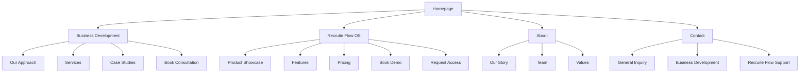
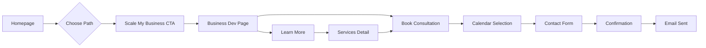
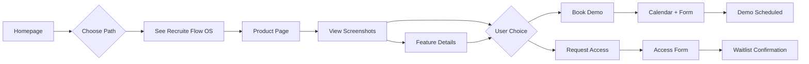
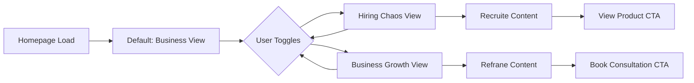

# Refrane Website UI/UX Specification

## Introduction

This document defines the user experience goals, information architecture, user flows, and visual design specifications for Refrane Website's user interface. It serves as the foundation for visual design and frontend development, ensuring a cohesive and user-centered experience.

### Overall UX Goals & Principles

#### Target User Personas

**1. Growth-Focused Founder**
- Startup or scale-up founder seeking strategic business development support
- Time-constrained, results-oriented, values expertise and proven methodologies
- Needs clear ROI demonstration and quick understanding of value proposition

**2. Overwhelmed Recruiter**  
- HR professional or hiring manager drowning in recruitment chaos
- Seeks efficiency, organization, and time-saving solutions
- Values intuitive tools that reduce manual work immediately

**3. Decision Maker**
- C-suite executive evaluating both consulting services and SaaS tools
- Requires high-level overview with ability to dive deeper
- Values credibility, case studies, and professional presentation

#### Usability Goals

- **Instant Clarity**: Users understand Refrane's dual offering within 5 seconds of landing
- **Efficient Navigation**: Users find their relevant path (business dev vs recruitment) in 2 clicks or less
- **Trust Building**: Professional design and clear information establish credibility immediately
- **Conversion Optimization**: Clear CTAs and minimal friction to consultation booking or demo request
- **Mobile Excellence**: Full functionality and beautiful experience on all device sizes

#### Design Principles

1. **Dual Clarity** - Clearly differentiate yet unify the two service offerings without confusion
2. **Premium Simplicity** - Sophisticated design that feels high-end yet remains approachable
3. **Smart Progressive Disclosure** - Reveal complexity only when users show intent to explore deeper
4. **Emotion Through Motion** - Use subtle animations to create delight and guide attention
5. **Accessibility First** - WCAG AA compliance built into every design decision

### Change Log

| Date | Version | Description | Author |
|------|---------|-------------|--------|
| 2025-08-15 | 1.0 | Initial UI/UX specification creation | UX Expert |
| 2025-08-15 | 1.1 | Updated to show interface screenshots instead of trial | UX Expert |

## Information Architecture (IA)

### Site Map / Screen Inventory

### Navigation Structure

**Primary Navigation:** 
- Logo (left) - returns to homepage
- Main nav (center/right): Business Development | Recruite Flow OS | About | Contact
- Dual CTA buttons (far right): "Book Consultation" (ghost) | "See Demo" (primary)
- Mobile: Hamburger menu with full-screen overlay

**Secondary Navigation:**
- Contextual sub-navigation appears on service pages
- Breadcrumbs on deep pages (3+ levels)
- Footer mega-menu with all major sections and quick links

**Breadcrumb Strategy:** 
- Show on all pages except homepage
- Format: Home > Section > Current Page
- Clickable for easy navigation back

## User Flows

### Flow 1: Business Development Consultation Booking

**User Goal:** Book a consultation to discuss business scaling needs

**Entry Points:** Homepage hero CTA, Business Development page, Navigation CTA

**Success Criteria:** Consultation booked with qualified lead information captured

#### Flow Diagram

#### Edge Cases & Error Handling:
- Calendar unavailable: Show waitlist option
- Form validation errors: Inline validation with helpful messages
- Network failure: Save form state locally, retry automatically
- Duplicate booking: Check email, prevent double-booking

**Notes:** Integration with Calendly or similar for real-time availability

### Flow 2: Recruite Flow OS Demo Request

**User Goal:** View product interface and request demo or early access

**Entry Points:** Homepage hero CTA, Product page, Pricing page

**Success Criteria:** Demo scheduled or access request submitted

#### Flow Diagram

#### Edge Cases & Error Handling:
- Images fail to load: Show placeholder with description
- Form submission fails: Retry with offline queue
- Calendar conflicts: Offer alternative times

**Notes:** Product screenshots showcase key features without requiring login

### Flow 3: Problem/Solution Toggle Interaction

**User Goal:** Explore relevant solutions based on specific problem

**Entry Points:** Homepage below hero section

**Success Criteria:** User sees relevant content and proceeds to appropriate service

#### Flow Diagram

#### Edge Cases & Error Handling:
- JavaScript disabled: Both sections visible by default
- Slow animation: Debounce toggle clicks
- Content fails to load: Show cached/default content

**Notes:** State persists during session, smooth 300ms transition

## Wireframes & Mockups

**Primary Design Files:** Figma (to be created based on these specifications)

### Key Screen Layouts

#### Homepage

**Purpose:** Introduce dual value proposition and guide users to appropriate path

**Key Elements:**
- Unified hero with headline, subheading, dual CTAs
- Problem/solution toggle section
- Dynamic services/features grid (6 cards, 3x2 desktop, 1x6 mobile)
- Success metrics with animated counters
- Testimonial carousel
- Footer with dual CTAs

**Interaction Notes:** Toggle transforms entire section content with fade transition, hover states on all interactive elements

**Design File Reference:** Homepage_Desktop_v1, Homepage_Mobile_v1

#### Business Development Page

**Purpose:** Deep dive into consulting services and drive consultation bookings

**Key Elements:**
- Hero with value prop and consultation CTA
- "Our Approach" visual timeline/process diagram
- Services grid with expand-on-hover cards
- Case study carousel with metrics
- Team expertise section
- Sticky CTA bar on scroll

**Interaction Notes:** Smooth scroll animations, case study modal overlays

**Design File Reference:** BusinessDev_Desktop_v1

#### Recruite Flow OS Product Page

**Purpose:** Showcase product interface and features to generate demo requests

**Key Elements:**
- Product hero with interface preview gallery
- Interactive screenshot carousel with feature callouts
- Features showcase with icon grid
- Interface screenshots section (dashboard, candidate pipeline, analytics)
- Pricing table with "Contact for Demo" CTAs
- Integration logos carousel
- FAQ accordion
- Dual CTAs (Book Demo / Request Access)

**Interaction Notes:** 
- Lightbox for full-size screenshot viewing
- Smooth carousel transitions between interface views
- Hover tooltips on feature points in screenshots
- FAQ smooth expand/collapse

**Design File Reference:** RecruiteFlow_Desktop_v1

## Component Library / Design System

**Design System Approach:** Custom component library built on React with Tailwind CSS utilities, maintaining brand consistency while allowing flexibility

### Core Components

#### Button

**Purpose:** Primary interaction element for CTAs and actions

**Variants:** Primary (blue fill), Secondary (blue outline), Ghost (transparent), Danger (red)

**States:** Default, Hover, Active, Focus, Disabled, Loading

**Usage Guidelines:** Primary for main CTAs, Secondary for alternative actions, minimum 44px touch target

#### Card

**Purpose:** Container for grouped content like services, features, case studies

**Variants:** Default (white bg), Elevated (shadow), Interactive (hover state), Feature (with icon)

**States:** Default, Hover (slight elevation), Selected (border highlight)

**Usage Guidelines:** Consistent padding (24px), border-radius (8px), hover transitions (200ms)

#### Screenshot Gallery

**Purpose:** Display product interface screenshots with captions

**Variants:** Carousel (with navigation), Grid (static layout), Lightbox (fullscreen view)

**States:** Default, Loading (skeleton), Enlarged (lightbox mode)

**Usage Guidelines:** 
- High-quality screenshots with consistent device frames
- Descriptive captions highlighting key features
- Lazy loading for performance
- Blur-up technique for progressive loading

#### Navigation Menu

**Purpose:** Primary site navigation across all pages

**Variants:** Desktop (horizontal), Mobile (hamburger overlay), Sticky (on scroll)

**States:** Default, Scrolled (background appears), Mobile Open

**Usage Guidelines:** Always accessible, current page highlighted, smooth transitions

#### Toggle Switch

**Purpose:** Problem/solution content switcher

**Variants:** Desktop (pill style), Mobile (full-width tabs)

**States:** Business Selected, Recruitment Selected, Transitioning

**Usage Guidelines:** Clear active state, smooth 300ms transition, accessible keyboard navigation

#### Form Input

**Purpose:** Capture user information for contacts and demos

**Variants:** Text, Email, Phone, Textarea, Select, Checkbox

**States:** Default, Focus, Valid, Error, Disabled

**Usage Guidelines:** Clear labels, helpful placeholders, inline validation, error messages below

## Branding & Style Guide

### Visual Identity

**Brand Guidelines:** Comprehensive Refrane brand guide provided (see brand assets)

### Color Palette

| Color Type | Hex Code | Usage |
|------------|----------|--------|
| Primary | #0080FF | Primary CTAs, links, brand accents |
| Secondary | #1A1A1A | Headers, primary text |
| Accent | #00D4FF | Highlights, secondary CTAs |
| Success | #10B981 | Success messages, positive metrics |
| Warning | #F59E0B | Important notices, warnings |
| Error | #EF4444 | Error states, validation messages |
| Neutral | #A0ACB8, #F3F4F6 | Secondary text, borders, backgrounds |

### Typography

#### Font Families
- **Primary:** Migra (headlines, headers)
- **Secondary:** TT Ramillas (body text, descriptions)
- **Logo/Brand:** Opensauce Semi-Bold

#### Type Scale

| Element | Size | Weight | Line Height |
|---------|------|--------|-------------|
| H1 | 48px/3rem | Bold | 1.2 |
| H2 | 36px/2.25rem | Bold | 1.3 |
| H3 | 24px/1.5rem | Semi-Bold | 1.4 |
| Body | 16px/1rem | Regular | 1.6 |
| Small | 14px/0.875rem | Regular | 1.5 |

### Iconography

**Icon Library:** Heroicons or Tabler Icons for consistency

**Usage Guidelines:** 
- Outline style for navigation and actions
- Solid style for emphasis and features
- Consistent 24px base size, scalable
- Always paired with text for accessibility

### Spacing & Layout

**Grid System:** 12-column grid with 24px gutters, max-width 1280px

**Spacing Scale:** 4px base unit (4, 8, 12, 16, 24, 32, 48, 64, 96px)

## Accessibility Requirements

### Compliance Target

**Standard:** WCAG 2.1 Level AA

### Key Requirements

**Visual:**
- Color contrast ratios: 4.5:1 for normal text, 3:1 for large text
- Focus indicators: 2px solid outline with 2px offset
- Text sizing: Minimum 14px, scalable to 200% without horizontal scroll

**Interaction:**
- Keyboard navigation: All interactive elements accessible via Tab
- Screen reader support: Proper ARIA labels and landmarks
- Touch targets: Minimum 44x44px on mobile

**Content:**
- Alternative text: Descriptive alt text for all images and screenshots
- Heading structure: Logical h1-h6 hierarchy
- Form labels: Associated labels for all inputs, required field indicators

### Testing Strategy

- Automated testing with axe-core in development
- Manual keyboard navigation testing
- Screen reader testing with NVDA/JAWS
- Color contrast validation with design tools

## Responsiveness Strategy

### Breakpoints

| Breakpoint | Min Width | Max Width | Target Devices |
|------------|-----------|-----------|----------------|
| Mobile | 320px | 767px | Phones |
| Tablet | 768px | 1023px | Tablets, small laptops |
| Desktop | 1024px | 1439px | Laptops, desktops |
| Wide | 1440px | - | Large monitors |

### Adaptation Patterns

**Layout Changes:** 
- Grid columns: 1 (mobile) → 2 (tablet) → 3-4 (desktop)
- Screenshot gallery: Stack vertically on mobile, carousel on tablet+
- Sidebar navigation → hamburger menu on mobile
- Stacked CTAs on mobile → inline on desktop

**Navigation Changes:**
- Desktop: Horizontal menu bar
- Tablet: Condensed horizontal with some items in overflow
- Mobile: Hamburger menu with full-screen overlay

**Content Priority:**
- Mobile: Essential content first, progressive disclosure for details
- Hide decorative elements on smaller screens
- Simplify complex visualizations for mobile
- Screenshot thumbnails on mobile, full previews on desktop

**Interaction Changes:**
- Touch gestures on mobile (swipe for carousels)
- Hover states only on desktop
- Larger touch targets on mobile/tablet
- Pinch-to-zoom enabled for screenshots on mobile

## Animation & Micro-interactions

### Motion Principles

1. **Purposeful**: Every animation guides attention or provides feedback
2. **Subtle**: Enhance without distraction (200-300ms duration standard)
3. **Consistent**: Same easing curves throughout (ease-in-out)
4. **Performant**: CSS transforms over property changes
5. **Accessible**: Respect prefers-reduced-motion

### Key Animations

- **Page Transitions:** Fade in content on route change (Duration: 200ms, Easing: ease-out)
- **Toggle Switch:** Smooth content transformation (Duration: 300ms, Easing: ease-in-out)
- **Button Hover:** Subtle scale and shadow (Duration: 150ms, Easing: ease-out)
- **Card Hover:** Elevation and slight scale (Duration: 200ms, Easing: ease-out)
- **Screenshot Gallery:** Slide transition between images (Duration: 350ms, Easing: ease-in-out)
- **Lightbox Open:** Fade and scale from thumbnail (Duration: 300ms, Easing: ease-out)
- **Scroll Animations:** Fade up on viewport entry (Duration: 400ms, Easing: ease-out)
- **Counter Animation:** Number increment on viewport (Duration: 1500ms, Easing: ease-in-out)
- **Menu Open:** Slide and fade overlay (Duration: 250ms, Easing: ease-out)
- **Form Validation:** Shake on error (Duration: 300ms, Easing: elastic)

## Performance Considerations

### Performance Goals

- **Page Load:** < 2 seconds on 4G
- **Interaction Response:** < 100ms for user inputs
- **Animation FPS:** Consistent 60fps for all animations

### Design Strategies

- Lazy load images and screenshots below the fold
- Use WebP format with fallbacks for all screenshots
- Implement progressive image loading for screenshots (blur-up technique)
- Optimize screenshot file sizes (< 200KB per image)
- Inline critical CSS
- Optimize font loading with font-display: swap
- Implement skeleton screens for loading states
- Use CSS transforms for animations (not position changes)
- Debounce/throttle scroll and resize events
- Virtual scrolling for long lists
- CDN hosting for all product screenshots

## Next Steps

### Immediate Actions

1. Create high-fidelity mockups in Figma based on these specifications
2. Prepare high-quality Recruite Flow OS interface screenshots
3. Build interactive prototype for stakeholder review
4. Develop component library in Storybook
5. Create screenshot gallery component with lightbox functionality
6. Refine demo booking flow based on sales team requirements

### Design Handoff Checklist

- [x] All user flows documented
- [x] Component inventory complete
- [x] Accessibility requirements defined
- [x] Responsive strategy clear
- [x] Brand guidelines incorporated
- [x] Performance goals established
- [ ] High-fidelity designs created
- [ ] Product screenshots prepared
- [ ] Interactive prototype built
- [ ] Developer documentation prepared
- [ ] Asset export completed

## Checklist Results

*[Pending design review and stakeholder approval]*